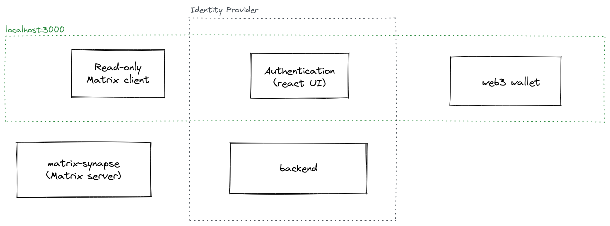
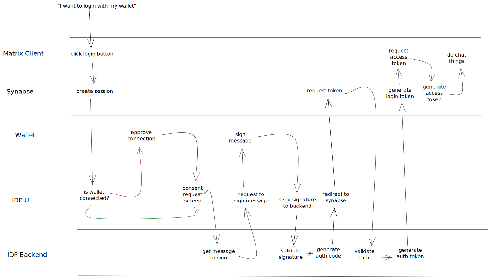

# Chat Client with OpenID Connect Login Pattern (Proof of Concept)

**This is a Proof of Concept, I do not recommend attempting to use this in production. Or with anything important.**

This project shows how to perform an OpenID Connect (OIDC) flow with identity provided via Ethereum wallet.

The project started life as a fork of [scaffold-eth@sign-in-with-web3](https://github.com/scaffold-eth/scaffold-eth/tree/sign-in-with-web3).

Sections:

* [Run in dev mode](#running-it)
* [Architecture](#architecture)
* [Login request flow](#login-flow)

Terminology:

* IDP - Identity Provider
* OIDC - OpenID Connect

## Running it

Run the Matrix Synapse server and OIDC backend application:

```sh
docker-compose up
```

Run the frontend app (chat client and OIDC UI):

```sh
yarn start
```

The client is hardcoded to connect to a specific room. You can either change that room or create it in your Synapse deployment.

## Architecture

The architecture is a little convoluted. There is the [`react-app`](packages/react-app) which is pulling double duty as both the chat client and the IDP user interface. The root path is the chat client and the `/auth` path handles IDP tasks.

The IDP is split between a frontend and a backend with the frontend requiring access to an Ethereum wallet in some way. This POC was tested with Metamask.



## Login flow

The process begins with a user wanting to connect to a Matrix chat room. To do so, an access token from Synapse is required to connect. At a high-level, the login flow steps are:

1. Create a session in Synapse
2. Begin an OAuth2.0 flow, redirecting to the IDP
3. Connect Ethereum wallet
4. Sign and validate a message with wallet
5. Continue OAuth2.0 by generating a token following the `authorization_code` flow
6. Use the OAuth2.0 token to get a login token from Synapse, exchange the login token for an `access_token`

For a deeper dive into the happy-path through all the redirects and API calls, take a look at this diagram:


